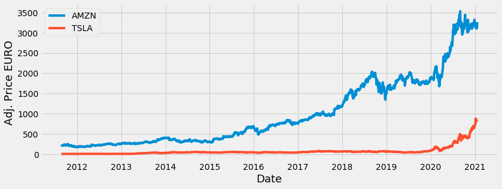

## Finance-Portfolio-Optimization
## Project Overview:
- Portfolio optimization is the process of selecting the best portfolio (asset distribution),out of the set of all portfolios being considered, according to some objective. The objective typically maximizes factors such as expected return, and minimizes costs like financial risk.-Wikipedia
- Created a programme to optimize a users portfolio using the Efficient Frontier.

## Code and Resources used:
**Python:** 3.7.6.

**Packages Used:** pandas,yfinance,numpy,datetime,matplotlib,PyPortfolioOpt,pulp

## Tasks:
- Create The Fictional Portfolio.
-  Create the data frame that will hold the stocks Adjusted Close price.
- Visually show the stock prices.

- Financial Calculations.
- Create and show the annualized co-variance matrix. 
- Calculate and show the portfolio variance.
- Show the expected annual return, volatility or risk, and variance.
- Optimize The Portfolio.
- Get the discrete allocation of each stock.

